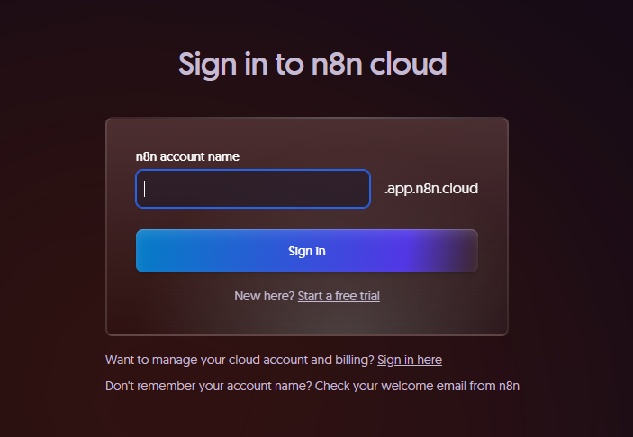
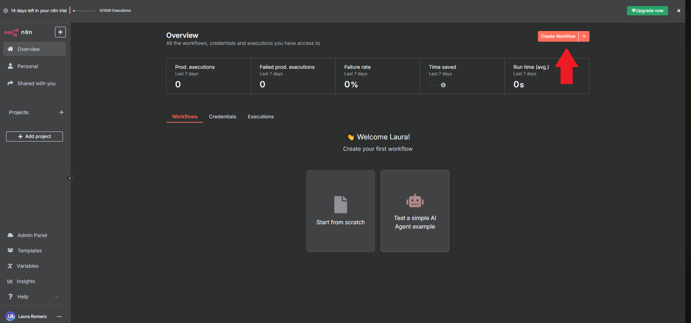
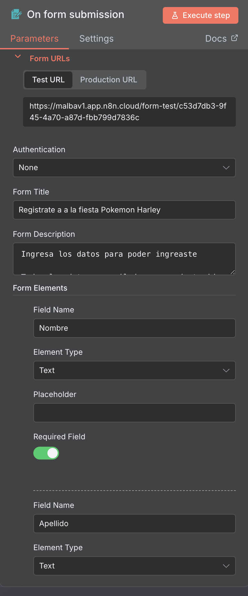
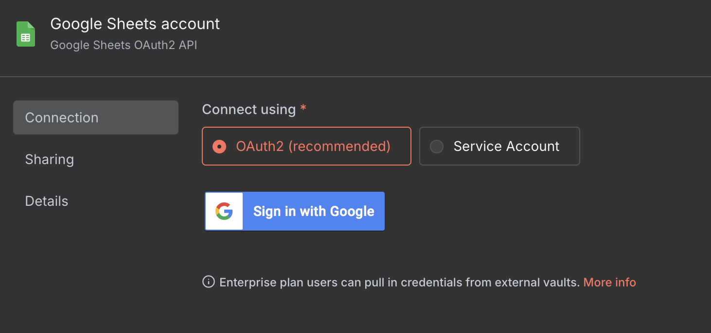
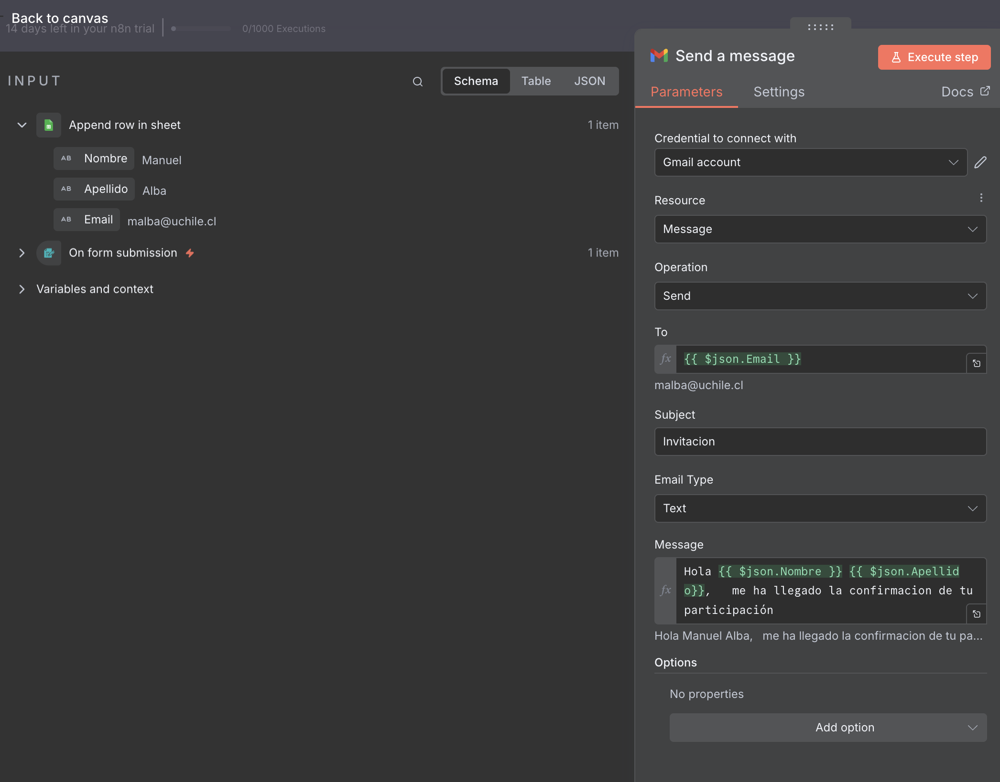
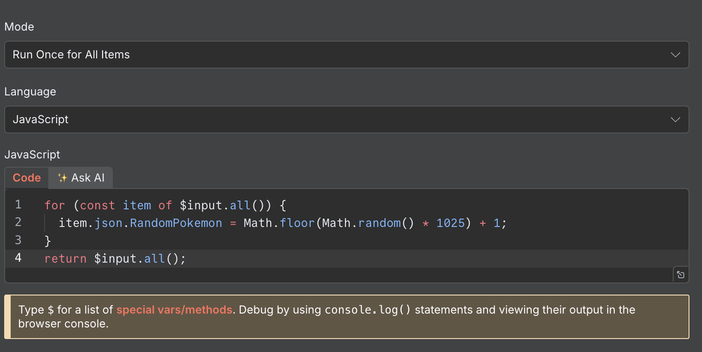
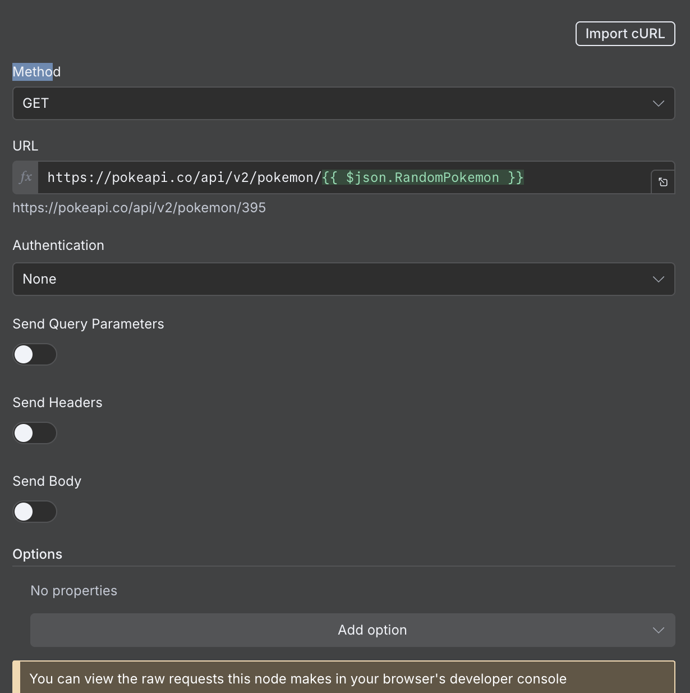
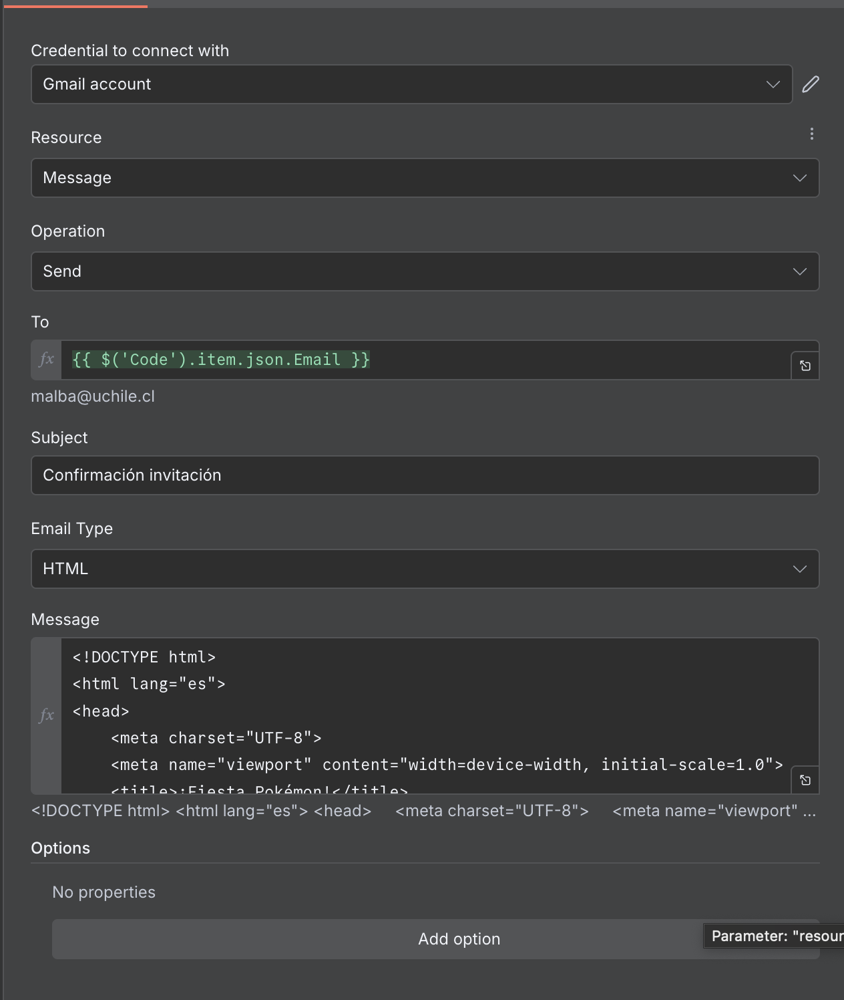
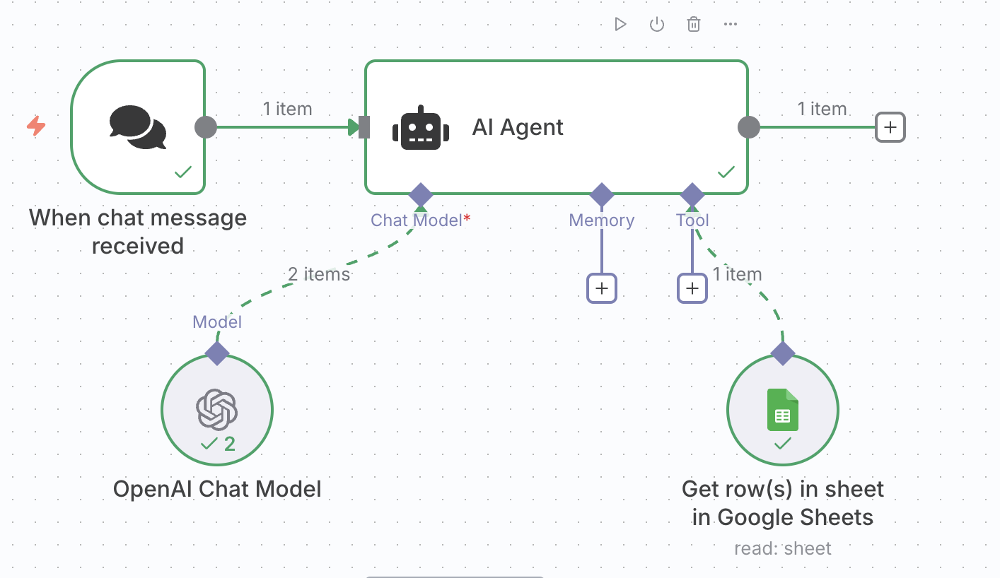

## Pasos para comenzar

 **Ingresa al sitio oficial**  
   Abre tu navegador y ve al siguiente enlace:  
   👉 [https://n8n.io/](https://n8n.io/)

 **Crea una cuenta nueva**  
   Haz clic en el botón `Get started` ubicado en la página principal.
     

 **Regístrate**  
   Llena el formulario de registro con tus datos. Asegúrate de definir un **nombre de usuario** que utilizarás para ingresar posteriormente.

   

 ## Crear un nuevo flujo en n8n

Haz clic en el botón **"New Workflow"** 

   


Haz clic en el ícono **`+`** ubicado en la parte superior izquierda para agregar un nuevo nodo.

  


## 🔧 Pasos para construir el flujo

### 1. Crear el nodo From 

- Agrega un nodo **On form submission**.

- Selecciona: "Workflows Finishes".
- Path: cambiar el path por que necesitemos



---

### 2. Agrega un nodo **Sheet**

Este nodo se debe configurar  :

- Las credenciales
- Las hoja
- Las columnas




### 2. Agrega un nodo **Gmail**

Este nodo se debe configurar  :

- Las credenciales
- El destinatario 
- El asunto 
- El mensaje




## Si todo esta bien deberia ver se asi


## Siguiente caso obtener datos desde google sheet


### 1. Agrega un nodo **Sheet**

Este nodo se debe configurar  :

- Las ya estan agregadas
- Las hoja
- Las columnas
- El filtro


### 2. Agrega un nodo **Code**

Este nodo genera:
- Un numero aleatorio

```javascript
for (const item of $input.all()) {
  item.json.RandomPokemon = Math.floor(Math.random() * 1025) + 1;
}
return $input.all();
```


### 3. Nodo HTTP Request - Consultar PokéAPI

- **Método:** `GET`  
- **URL:**

```bash
https://pokeapi.co/api/v2/pokemon/{{ $json.RandomPokemon }}
```
⚙️ Este paso permite obtener los datos del Pokémon generado aleatoriamente.




### 2. Agrega un nodo **Gmail**

Este nodo se debe configurar  :

- Las credenciales
- El destinatario 
- El asunto 
- El mensaje




### Bonus track ###

Agregar ia ?
